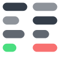
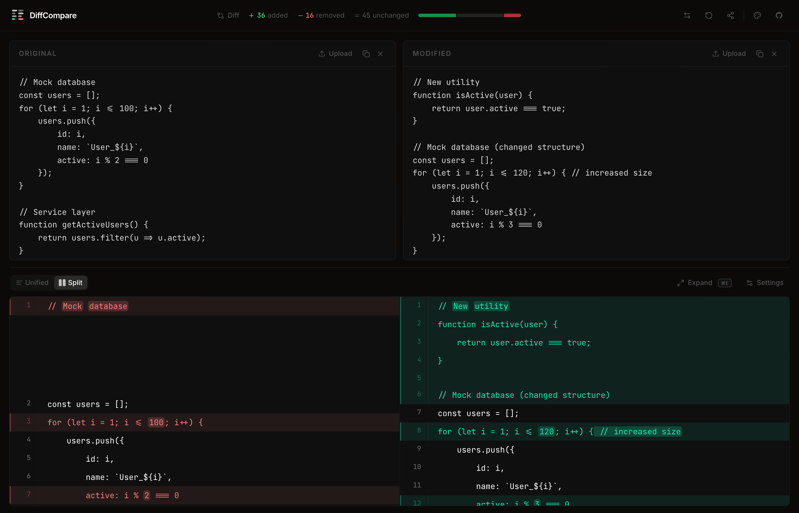
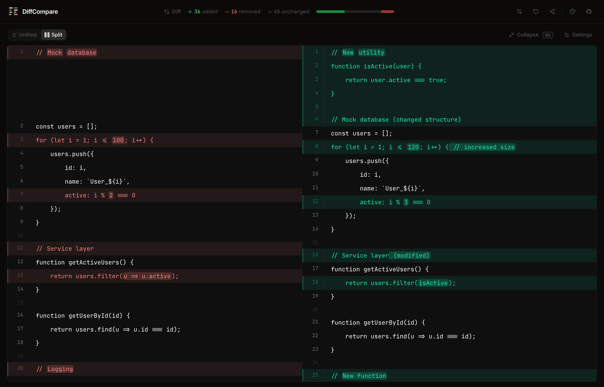
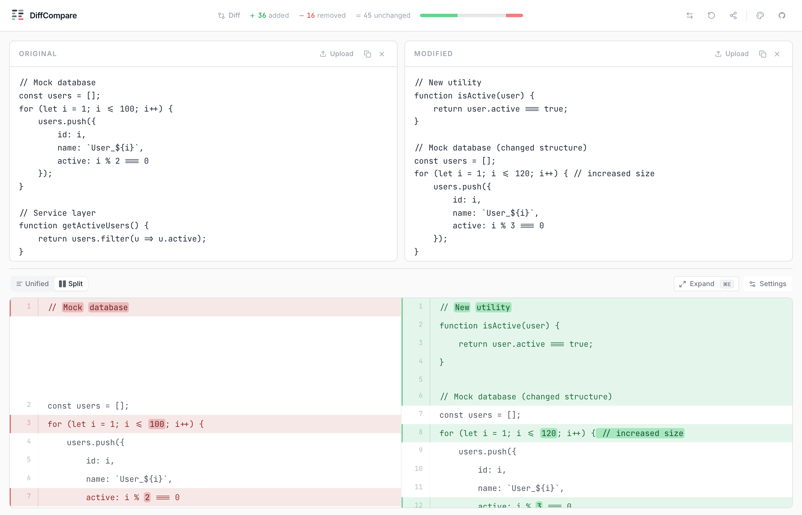
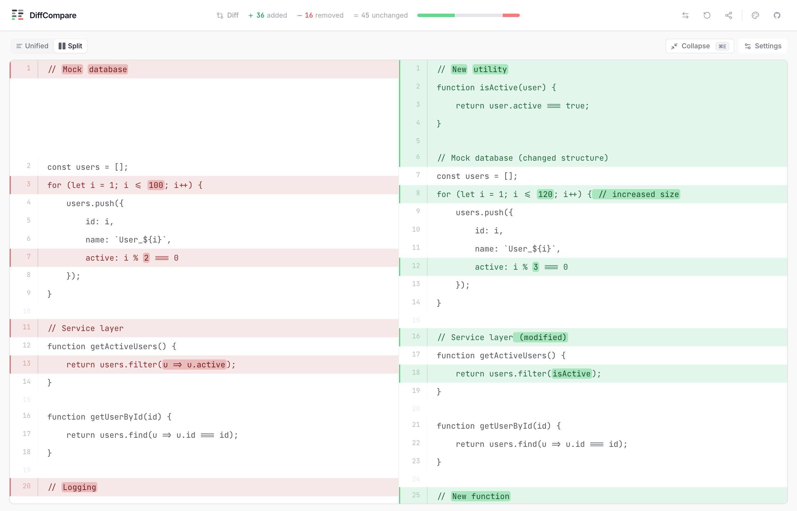

<div align="center">
  
  <h1>DiffCompare</h1>
  <p>A free, minimal, open-source, ad-free online diff tool to compare text and code side-by-side.</p>

  <p>
    <a href="https://diffcompare.narayann.dev/" target="_blank"></a>
    
    
    
    
  </p>
</div>

<div align="center">
  
  <br/>
  <br/>
  
  <br/>
  <br/>
  
  <br/>
  <br/>
  
</div>

---

## ⚡️ Introduction
**DiffCompare** is a fast, responsive, and highly customizable online diff checker. Built with React and Vite, it's designed to make spotting code and text differences effortless : with zero ads, zero tracking, and no sign-up required.

Whether you need a **side-by-side diff**, a **unified diff view**, or an **animated replay** of changes, DiffCompare delivers a clean, developer-focused experience. It works entirely in the browser : paste text, upload files, or share diffs with teammates instantly over P2P (no server needed).

## 🎯 Features
- **Multiple Diff Views**: Choose between Split (Side-by-side) and Unified view modes.
- **File Upload & Editing**: Load text or code files directly, or write/paste content into the Original and Modified editor panels.
- **Diff Statistics**: Visual summary of added, removed, and unchanged lines.
- **Advanced Diff Settings**: Fine-tune comparisons with toggles to ignore whitespace, case, empty lines, and line endings.
- **Minimap Support**: Navigate through long files easily using the built-in minimap.
- **Expand/Collapse View**: A distraction-free, expanded view of the diff layout complete with keyboard shortcut access (`Cmd/Ctrl + E`).
- **Copy Functionality**: Allows one-click copying of the full diff output.
- **Swap**: Instantly swap the Original and Modified panels with a single click.
- **P2P Live Sharing**: Share your diff with anyone via a generated link : powered by WebRTC (PeerJS). No server, no sign-in. The recipient opens the link and the diff loads instantly.
- **Multiple Color Themes**: Work comfortably with Dark, Light, Dracula, Ocean, and Skillz themes.
- **Animated Diff Replay**: Render an animated replay of your diffs using the fully integrated Remotion animation modal.

## 📁 Folder
Here's a high-level overview of the project structure:

```text
.
├── assets             # Static graphical assets (like the SVG icon)
├── docs               # Documentation files (e.g., features, todo lists)
├── dump               # Dump files/Examples for testing
├── src
│   ├── components     # All reusable React components and toolbars
│   ├── hooks          # Application hooks (themes, diff algorithms, P2P sharing)
│   ├── lib            # Utility functions and core diff logic
│   ├── App.tsx        # Main application layout component
│   ├── index.css      # Core tailwind stylesheet
│   └── main.tsx       # Entry point
├── package.json       # Project dependencies
├── tailwind.config.js # Tailwind engine configuration
└── vite.config.ts     # Vite bundler configuration
```

## ⚙️ Installation
Make sure you have [Bun](https://bun.sh/) installed. Follow these steps to run the application locally:

```bash
# Clone the repository
git clone https://github.com/EveryDayApps/diff-compare.git

# Change directory
cd diff-compare

# Install dependencies using Bun
bun install

# Start the local development server at localhost:5173
bun run dev

# To build for production
bun run build
```

## 🌱 Third Party Libraries
- [Vite](https://github.com/vitejs/vite) : Lightning-fast frontend build tool.
- [React](https://github.com/facebook/react) : A declarative, efficient, and flexible JavaScript library for building user interfaces.
- [Tailwind CSS](https://github.com/tailwindlabs/tailwindcss) : A utility-first CSS framework for rapid UI development.
- [Lucide React](https://github.com/lucide-icons/lucide) : Beautiful & consistent icons toolkit.
- [Remotion](https://github.com/remotion-dev/remotion) : Create videos programmatically using React.
- [PeerJS](https://github.com/peers/peerjs) : Simplified WebRTC peer-to-peer data connections for live diff sharing.
- [Bun](https://github.com/oven-sh/bun) : Fast all-in-one JavaScript runtime.

## 📚️ Roadmap
- Support for inline code merging and editing directly within diffs.
- Automatic syntax highlighting based on file extension.
- Export functionality for saving diff outputs to PDF or Image.
- GitHub integration for easily fetching pull request diffs.

## ❤️ Acknowledgements
- Layout inspiration taken from traditional IDE diff viewer interfaces.
- Syntax and theme aesthetic inspirations drawn from modern developer tooling.

## ‍💻 Author
- [@narayann7](https://github.com/narayann7) : maintained under [EveryDayApps](https://github.com/EveryDayApps)

## 🌐 Live
**[https://diffcompare.narayann.dev](https://diffcompare.narayann.dev)**  try it instantly, no sign-up needed.

## ⭐️ Contribute
If you find this project useful or want to support its active development:
1. Add a GitHub Star to the [repository](https://github.com/EveryDayApps/diff-compare).
2. Share the repository on Twitter/LinkedIn.
3. Open an issue or submit a Pull Request with your improvements.
4. Support the project by dropping feedback in the discussions!

## 🧾 License
This project is licensed under the MIT License. See the [LICENSE](LICENSE) file for more information.